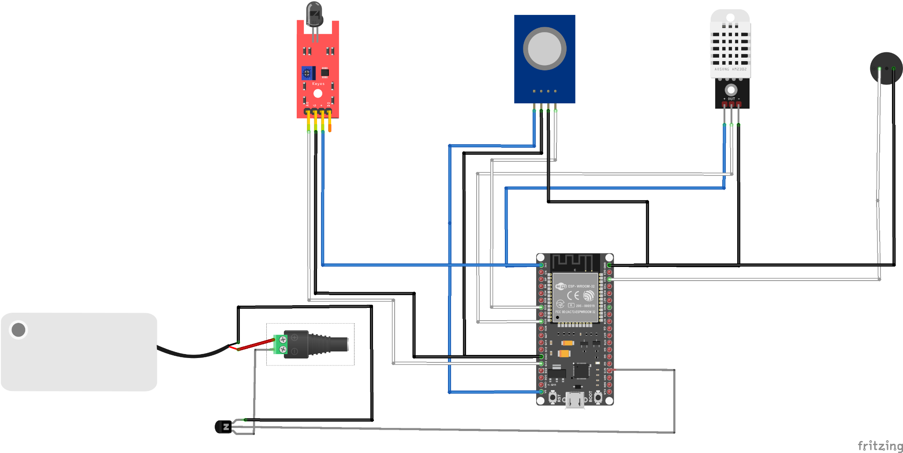
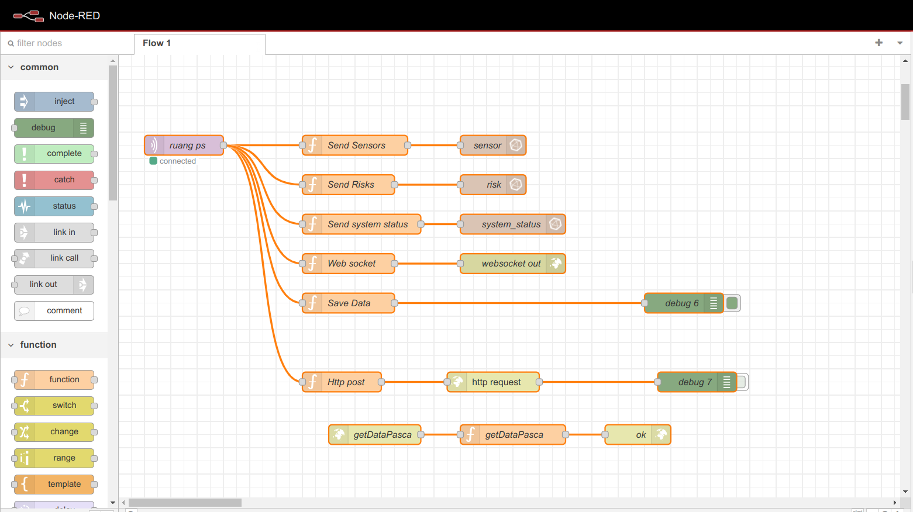
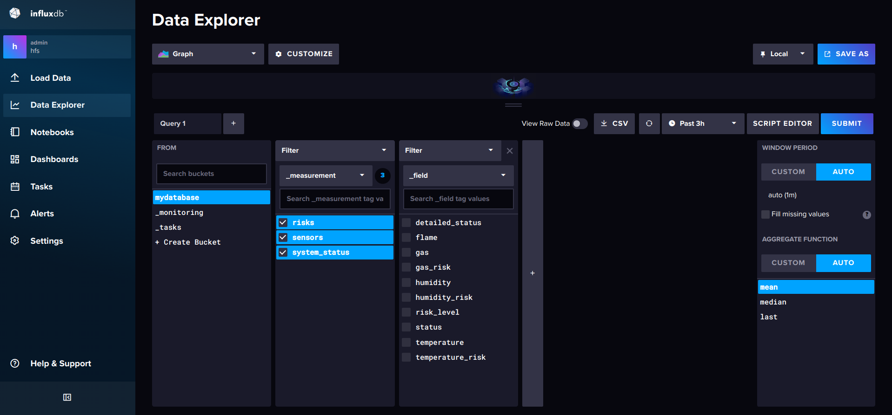
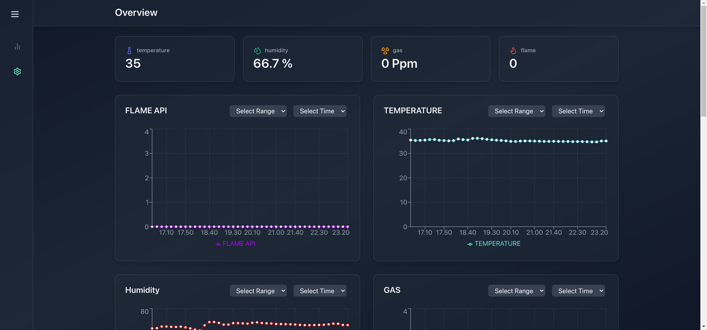

<div align="center">

  <h1>Fire Detection System with Fuzzy Logic</h1>

</div>

<br />

<!-- Table of Contents -->

# :notebook_with_decorative_cover: Table of Contents

- [About the Project](#star2-about-the-project)
  - [Tech Stack](#space_invader-tech-stack)
  - [usage](#dart-usage)
- [License](#warning-license)
- [Contact](#handshake-contact)
<!-- About the Project -->

## :star2: About the Project

</div>

### :space_invader: Tech Stack

<details>
  <summary>ESP 32</summary>
   
  <ul>
    <li><a href="https://www.freertos.org/">FreeRTOS</a></li>
      <li><a href="https://en.wikipedia.org/wiki/MQTT">MQTT</a></li>
    <li><a href="https://en.wikipedia.org/wiki/Fuzzy_logic">Fuzzy Logic</a></li>
      <li><a href="https://en.wikipedia.org/wiki/Fuzzy_logic">Fuzzy Logic</a></li>
    <li><a href="https://github.com/adafruit/DHT-sensor-library">DHT22</a></li>
    <li><a href="https://sandboxelectronics.com/?p=165">MQ2</a></li>
     <li><a href="https://en.wikipedia.org/wiki/Flame_detector">Flame sensors</a></li>
     <li>Water Pump</li>
  </ul>
</details>

<details>
  <summary>Node Red</summary>
  
  <ul>
    <li>MQTT IN</li>
    <li>INFLUXDB OUT</li>
    <li>HTTP REQUEST</li>
    <li>Web Socket</li>
  </ul>
</details>
<details>
<summary>Database InfluxDB v2</summary>
 <a href="https://docs.influxdata.com/influxdb/v2/"></a>
</details>

<details>
<summary>React</summary>
<a href="https://en.wikipedia.org/wiki/React"></a>
</details>
<details>
<summary>WhatsApp Bot</summary>
  <ul>
    <li><a href="https://github.com/WhiskeySockets/Baileys">Baileys</a></li>
  </ul>

</details>
<details>
<summary>Docker</summary>
  <ul>
    <li><a href="https://www.docker.com/">Docker</a></li>
  </ul>
</details>

### :dart: Usage

Clone the project

```bash
  git https://github.com/indonumberone/fire_detection_system
```

run docker compose

```bash
  docker compose up -d
```

scan QR in the WhatsApp BOT

```bash
  docker logs wa-bot --follow
```

start reactJS

```bash
 cd monitoring-data-with-react
 npm i
 npm run dev or npm run build
```

<!-- License -->

## :warning: License

Distributed under the no License. See <a href="LICENSE.txt">LICENSE.txt</a> for more information.

<!-- Contact -->

## :handshake: Contact

  <ul>
    <li><a href="https://www.instagram.com/flyingcat121/">Instagram</a></li>
    <li><a href="https://twitter.com/muqsith_barru">Twitter</a></li>
  </ul>
